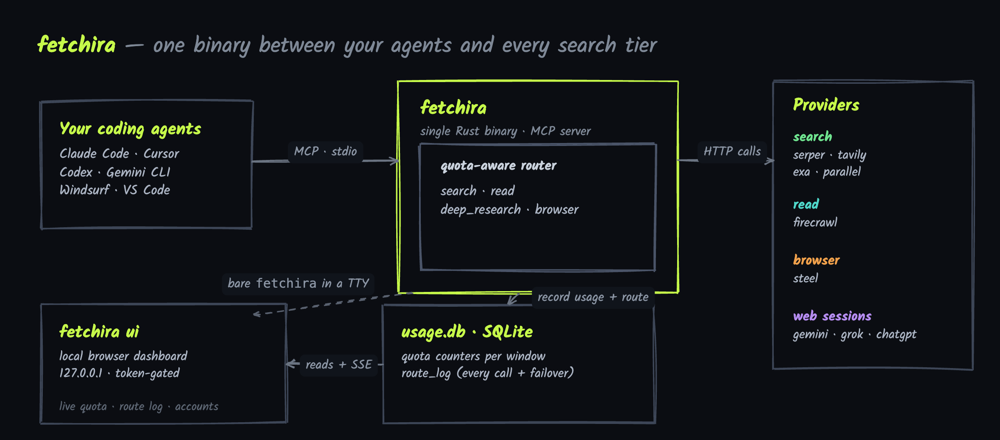
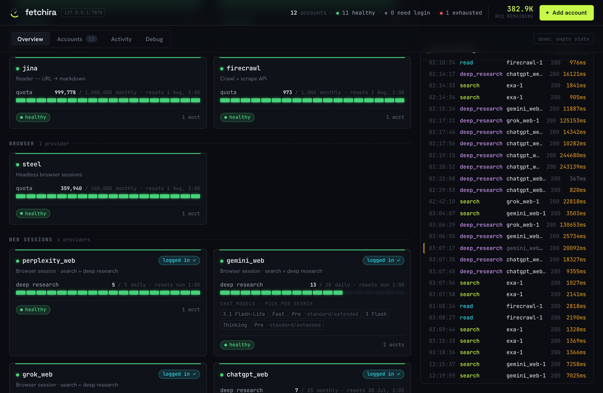
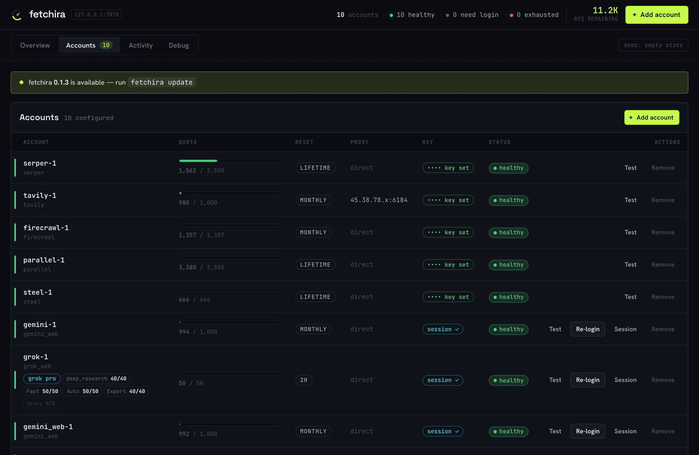
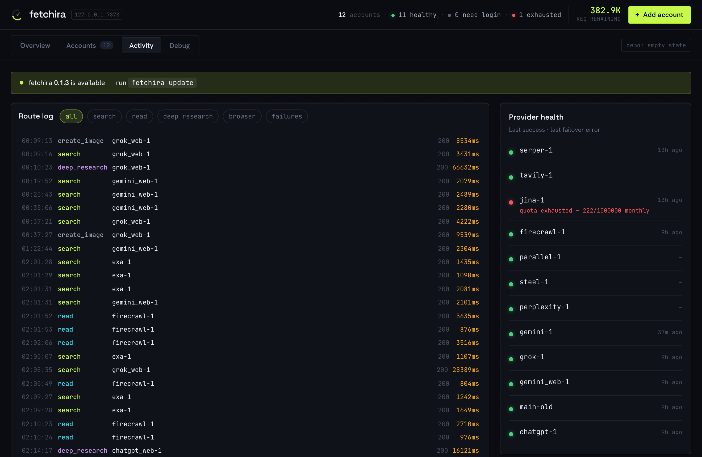
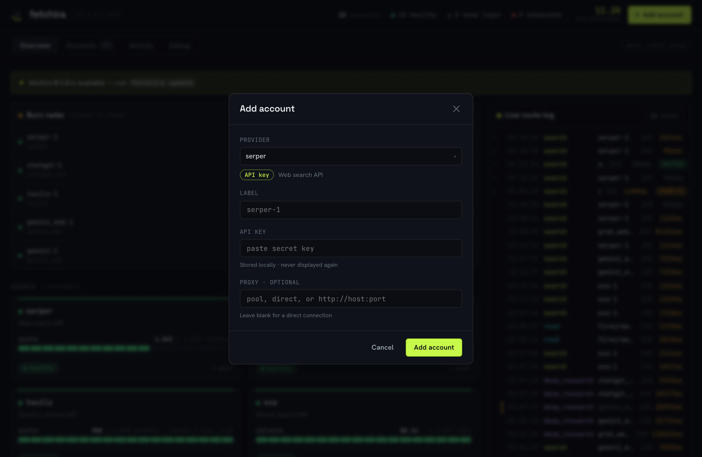

# fetchira

One small binary that sits between your coding agent and every web-search and
scrape tier, and spends them so you don't have to think about it.



---

## What it is

A handful of services give away a real amount of free web search every month — Serper,
Tavily, Exa, Parallel for search, Firecrawl for reading pages, Steel for headless
browsing. Your logged-in Gemini, Grok and ChatGPT web sessions add even more —
search, multi-step deep research, image generation and file Q&A. Used together they cover a
lot of an agent's research, for free.

The catch is the bookkeeping. Each provider has its own API, its own key, its own quota and
its own reset window. To actually lean on the free tiers you have to remember which key goes
where, track who is exhausted this month, and switch to another provider the moment one
starts returning `429`. Nobody wants to do that by hand, and an agent certainly can't.

fetchira is that bookkeeping, turned into a program. It is a single Rust binary that speaks
**MCP** (the Model Context Protocol) to your coding agent. The agent asks for a generic
capability — *search this*, *read this URL*, *do deep research*, *drive a browser* — and
fetchira chooses the least-exhausted account for that capability, calls it, and fails over to
the next one if it errors. It keeps a running count of what each account has left, so the
free quota gets spent evenly instead of one key burning out while the rest sit idle.

It also ships with a **local dashboard** so a human can watch the same thing in real time and
manage accounts without touching a config file.

## What you get

| Capability | The agent calls | fetchira routes to (in preference order) |
|---|---|---|
| **search** | `search` | serper → tavily → exa → parallel → gemini_web → grok_web → chatgpt_web |
| **read** | `read` | firecrawl (auto-escalates to a headless browser if the plain read is empty) |
| **deep research** | `deep_research` | parallel → exa → tavily → gemini_web → grok_web → chatgpt_web |
| **image** | `create_image` | grok_web → gemini_web → chatgpt_web |
| **file Q&A** | `search` / `deep_research` + `file` | attach a local file to a grok / gemini / chatgpt turn and ask about it |
| **browser** | `browser` | steel |
| **usage** | `usage` | live balance + per-tier limits + model/mode catalog, and a per-provider capability sheet |

- **Quota-aware routing.** Every call goes to the account with the most free quota left for
  that capability. A `429`/`402` marks that budget exhausted for the period and the router
  stops sending to it until the window resets.
- **Automatic failover.** If the chosen account errors, fetchira moves to the next one for the
  same capability and the agent never sees the hiccup. Force a single backend with
  `provider: "exa"` and it fails over only among that provider's own accounts.
- **Many accounts per provider.** Add `exa-1`, `exa-2`, … and the router load-balances across
  them by remaining quota.
- **A sticky proxy per account.** Give each account its own outbound IP (`proxy = "pool"` from
  a Webshare pool, or a pinned URL) so multiple free accounts don't share one address.
- **Real balances, live.** Where a provider exposes it, fetchira reads the actual figure from the
  account instead of guessing from a nominal cap — credits for serper / tavily / firecrawl, a real
  dollar balance for exa / parallel / steel (shown as `$balance · ≈N requests`).
- **Niche research, not just keywords.** `search` and `deep_research` take `topic` (web / news /
  academic), `recency`, `domains` (include, or `-` to exclude) and `depth` — each mapped to the
  backend's native filter (Google News / Scholar, exa categories, date ranges) or folded into the
  query. `usage(provider=…)` returns that backend's full sheet: its niches, `mode` escape hatches,
  and ready-to-copy example calls.
- **Web sessions, not just API keys.** gemini_web / grok_web / chatgpt_web authenticate with your
  real logged-in browser cookies and return a synthesized answer with sources — plus multi-step
  Deep Research (Gemini, Grok and ChatGPT), image generation and file Q&A. `usage` reports each
  session's live per-tier limits and its selectable model/mode catalog. See
  [Web sessions](#web-sessions) below.
- **A local dashboard.** Live quota, a streaming route log, and full account management in the
  browser — covered next.

## The dashboard

```sh
fetchira ui          # opens http://127.0.0.1:7878 in your browser
```

An instrument panel for the router. The **Overview** groups every provider by capability and
shows, per account, how much free quota is left and when it resets — next to a live log of
calls as they happen.



**Accounts** is the management surface: every account with its quota bar, reset window, proxy,
key/session status and health. Add, remove, re-login or send a real "Test" probe to any
account, all from here — it writes the same config file the CLI does. Secrets are never sent
to the browser (keys show as `•••• key set`, proxy credentials are masked).



**Activity** is the full route log with filters, per-provider health, and the failover story
written out — `exa-1 429 → tavily-1`, last success and last error per provider. Click any call to
open what it sent and got back; the **Debug** tab keeps that same per-request detail with the raw
HTTP — headers and body, secrets redacted — for when something needs tracing.



Adding an account is a small form — pick a provider, paste a key (or log in, for web sessions),
optionally pin a proxy:



The whole dashboard is **self-contained and offline**: the assets (including React) are embedded
in the binary, so there is no Node, no build step and no CDN. It binds to `127.0.0.1` only and
is gated by a per-session token in the URL plus `Host`/`Origin` checks.

## How it works

One capability call turns into "pick an account, call it, fall back if it fails, record what
happened" — and the dashboard sees the result live:


**Quota tracking.** Usage lives in a SQLite file (`usage.db`), keyed by `(account, period)`
where the period is `YYYY-MM` (monthly), `YYYY-MM-DD` (daily) or `lifetime`. Each window is a
fresh row, so quotas reset automatically when the calendar turns over. A successful call
increments the counter; a `429`/`402` marks the budget exhausted for the period. These are
**soft local guards** — the provider's `429` is always the source of truth and is what triggers
failover. Deep research is tracked on its own daily budget per web provider, because those
limits are tighter and time-windowed.

**The dashboard is a separate process.** Your agent runs one fetchira process (the MCP server);
`fetchira ui` is another. They never talk directly — they share the one `usage.db`. Every call
the router serves is appended to a `route_log` table (including failover hops), and the
dashboard reads quota and the route log straight from that file, streaming new lines to the
browser over Server-Sent Events. That is why the live log keeps working no matter which process
actually handled the request.

**One binary, two modes.** The same executable is both the MCP server and the dashboard. Run
bare `fetchira` from an interactive terminal and it opens the UI; when a coding tool launches it
over piped stdio it serves MCP exactly as before. Force either with `fetchira serve` /
`fetchira ui`, or set `FETCHIRA_NO_UI=1`.

## Install and set up

**Homebrew** (macOS + Linux):

```sh
brew install ImmuneFOMO/tap/fetchira
```

**Or `curl | sh`** — downloads the prebuilt binary for your platform into `~/.local/bin`:

```sh
curl -fsSL https://raw.githubusercontent.com/ImmuneFOMO/fetchira/main/install.sh | sh
```

**From source** (in a checkout — builds with cargo):

```sh
./install.sh          # builds, installs the binary to ~/.local/bin
```

Then configure providers:

```sh
fetchira setup        # guided: pick providers, paste API keys, log into the web ones
```

Update later with `brew upgrade fetchira` (Homebrew) or `fetchira update` (curl|sh / manual install).

`setup` walks every provider, asks which you want, prompts for the API key (key-based) or opens
a browser to log in (web-session), and writes everything to **global config** in
`~/.config/fetchira/` — no manual `.env` editing. Re-run any time. Config lives in
`$FETCHIRA_HOME` or `~/.config/fetchira` (`fetchira.toml` + `usage.db`), so the binary works no
matter which directory an MCP client launches it from.

## CLI

```sh
fetchira ui                     # open the local dashboard (live quota, accounts, route log)
fetchira providers              # list every available provider and what it does
fetchira list                   # your accounts + remaining quota + login status
fetchira add <provider>         # add an account (prompts for key, or logs in if web)
                                #   flags: --label L  --key K  --proxy pool|URL
fetchira remove <label>         # delete an account (and its session/usage)
fetchira login <provider>       # (re)capture a web-session login via a browser
fetchira session <label>        # attach a web session by hand (cookies JSON on stdin or --file)
fetchira install                # register fetchira with your coding tools
fetchira update                 # download & install the latest release (or `brew upgrade`)
fetchira --version              # print the installed version
fetchira help
```

`fetchira add tavily` asks for the key; `fetchira add gemini_web` opens a browser to log in (or,
with no browser, falls back to `fetchira session` — see [Web sessions](#web-sessions)). Multiple
accounts per provider are fine (`--label tavily-2`); the router balances by remaining quota.

## Register with your coding tools

The binary **is** the MCP server (stdio). The easy way is to let it write each tool's config:

```sh
fetchira install
```

It detects and supports Claude Code, Codex CLI, OpenCode, Gemini CLI, Cursor, Windsurf, VS Code
and Claude Desktop — multi-select, then it writes the right config shape for each (merging,
never clobbering your existing servers). Restart the tool to pick it up.

Manual registration is just as easy — point any MCP client at the binary:

```sh
claude mcp add fetchira -s user -- ~/.local/bin/fetchira     # Claude Code
```
```jsonc
// generic mcp.json (Cursor, Windsurf, Gemini CLI, Claude Desktop)
{ "mcpServers": { "fetchira": { "command": "/Users/you/.local/bin/fetchira" } } }
```

stdout is the MCP channel; logs go to stderr (`RUST_LOG=debug` for more). For Claude Code there
is also a skill in `skills/fetchira/SKILL.md` — copy it to `~/.claude/skills/fetchira/SKILL.md`
so the agent knows when and how to use the tools.

## Web sessions

gemini_web, grok_web and chatgpt_web use your **logged-in browser cookies** instead
of an API key, via a Chrome-impersonating client. One-time setup per provider:

```sh
fetchira login gemini_web   # opens a browser; log in, then it captures the session
fetchira login grok_web
fetchira login chatgpt_web
```

`fetchira login <provider>` launches a real browser against a dedicated profile, waits for you to
finish logging in, captures the cookies (HttpOnly included) and stores them in `usage.db`. It uses
**Chrome/Chromium/Edge/Brave** (over the DevTools protocol) if present, otherwise **Firefox**
(read straight from its plaintext `cookies.sqlite`, since Firefox dropped CDP). Set
`FETCHIRA_BROWSER=chrome|firefox` to force one. These accounts get the same sticky-proxy support
as API accounts.

**Headless / no browser?** On a server with no GUI, log in on any other machine (or any browser),
export the cookies as JSON, and attach them by hand — no browser needed on the box that runs
fetchira:

```sh
fetchira add gemini_web --label gemini_web-1      # saved even though the browser login is skipped
fetchira session gemini_web-1 --file cookies.json # or: paste/pipe the JSON on stdin
```

The JSON is a cookie array (`[{"name":"sso","value":"…","domain":".grok.com"}]`) or
`{"cookies":[…]}` — the shape a "Cookie Editor" browser extension exports. The dashboard has the
same paste box (Add account → *or paste a session*, or the **Session** button on any web account).

**Conversations, models, modes.** Web results end with a `session: …` token; pass it back as
`session` to continue the same chat with full history. Optional `model` and `mode` select per
provider (best-effort; subscription features may be locked):

```jsonc
search { "query": "...", "provider": "gemini_web" }                       // -> answer + session token
search { "query": "follow-up", "session": "gemini_web:c_…,r_…" }          // continues the chat
```

**Deep Research.** Gemini and ChatGPT run the real plan-based flow — `deep_research` returns a plan
plus a `session`; send `"start"` on that session to run it (or a revised request to replace the
plan). Gemini returns the report in the same call (~1-3 min); ChatGPT then runs for ~5-30 min, so it
hands back a `session` you call again to fetch the finished report. Grok runs deep research directly
on its heavy tier (no plan step), and exa / parallel do true multi-round research over the API.

**Images and file Q&A.** `create_image` generates from a text prompt — grok and gemini render
in-process over HTTP, chatgpt drives the browser; it returns the image bytes, not a link. To ask
about a local file or image, pass its path as `file` on `search` or `deep_research` (defaults to
grok). Both take an optional `provider` and fail over like everything else.

**Live limits.** `usage` polls each web session for its real per-tier limits and the model/mode
catalog it can select (with thinking levels) — a mode locked by your subscription (e.g. Grok
Expert/Heavy on a lapsed plan) shows as `0/0`.

Caveats, inherent to reverse-engineered web access:
- **Sessions expire.** Cloudflare's `cf_clearance` lasts ~30 min to a few hours and cannot be
  minted headless. Re-run `fetchira login <provider>` (or re-attach with `fetchira session`) when a
  provider returns session/403 errors; the router fails over to the API providers meanwhile.
- **Grok is intermittent.** fetchira forges the anti-bot `x-statsig-id` per request, which gets
  past grok.com, but grok is aggressive on IP reputation and rate. Better odds: a fresh login, a
  residential `proxy`, and no bursting. The router fails over when grok blocks.
- **ChatGPT drives a real browser.** chatgpt.com gates every send behind a Turnstile challenge pure
  HTTP can't pass, so chatgpt_web submits through the logged-in browser profile (reads like limits
  stay pure HTTP). It needs Chrome/Chromium available; deep-research polls resume over plain HTTP.
- Browser login needs Chrome/Chromium/Edge/Brave or Firefox installed (Linux names like
  `google-chrome`, `chromium`, `firefox` are resolved on `$PATH`). With none — or a headless box —
  use `fetchira session` instead. The first build compiles BoringSSL (needs `cmake` + a C/C++
  toolchain — Xcode CLT on macOS, `build-essential` on Linux).

## Tuning quota

API providers (serper, tavily, firecrawl, exa, parallel, steel) report their real remaining balance,
so their numbers are live and need no tuning. The web sessions have no balance endpoint, so their
per-account numbers are nominal defaults you set in `fetchira.toml` to match your plan — tracked as
separate chat and deep-research budgets:

```toml
[[account]]
provider = "gemini_web"
label    = "gemini-1"
quota    = 5000          # chat/search budget
reset    = "monthly"     # monthly | daily | once
dr_quota = 100           # deep-research budget (e.g. an AI Pro/Ultra tier)
dr_reset = "daily"
```

A Webshare proxy pool is optional; accounts with `proxy = "pool"` draw a sticky proxy from it.
See `fetchira.toml.example` and `.env.example` for the full shape.

## Build and verify

```sh
cargo build --release
cargo fmt --check && cargo clippy --all-targets -- -D warnings && cargo test
```

Research notes that shaped the design live in [`research/`](research/).
