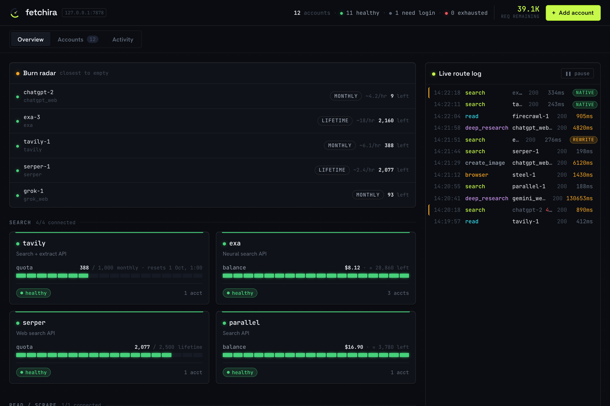

# Fetchira

Web search, page reading, deep research and image generation through one router. Use the
CLI or connect your agent through MCP. Bring an API key or a supported web session;
Fetchira routes requests across your configured accounts and providers.

## Start locally

Install on macOS with Homebrew:

```sh
brew install ImmuneFOMO/tap/fetchira
```

On Linux or macOS without Homebrew:

```sh
curl -fsSL https://raw.githubusercontent.com/ImmuneFOMO/fetchira/main/install.sh | sh
```

See [installation](docs/setup.md#install) for Linux arm64, building from source and PATH setup.

Add a provider and make a request:

```sh
fetchira add serper --key 'YOUR_SERPER_KEY'
fetchira search "latest Rust release"
fetchira read "https://example.com"
```

Get a Serper key at [serper.dev](https://serper.dev), or run `fetchira providers` to choose
another provider. Each provider has its own plan and quota; paid features can consume a
paid balance. For browser login instead of an API key, run `fetchira add gemini_web`.

MCP is optional. Run `fetchira setup` to choose local accounts or an existing hosted server.
For an agent, `fetchira install` offers CLI only, MCP, or MCP with CLI fallback, then installs
the matching skill in your selected agents. Restart the agent after installation.
`fetchira ui` opens the local dashboard.



## Choose a guide

| I want to… | Guide |
|---|---|
| Install, connect an agent, or choose a skill | [Setup](docs/setup.md) |
| Search, research, generate images, or continue a session from a shell | [CLI](docs/cli.md) |
| Manage accounts, quotas, proxies, or troubleshoot a failure | [Configuration](docs/configuration.md) |
| Share one private server through CLI or MCP | [Hosted deployment](docs/hosted.md) |
| Build, test, contribute, or release | [Contributing](CONTRIBUTING.md) · [Releasing](docs/releasing.md) |

## Hosted

To use an existing server, get its URL and API key from the administrator. Run
`fetchira setup` and choose **Connect to a server** to verify access before saving.
For scripted setup, save the connection and check it:

```sh
fetchira remote set https://fetchira.example.com/mcp --key 'fk_live_...'
fetchira remote check
```

CLI and MCP both use the configured server; generated images and PDFs are saved on your
computer. Laptop file attachments require local mode through either interface.
See [hosted deployment](docs/hosted.md) to run your own server.

[Apache-2.0 license](LICENSE) · [Report a security issue](SECURITY.md)
