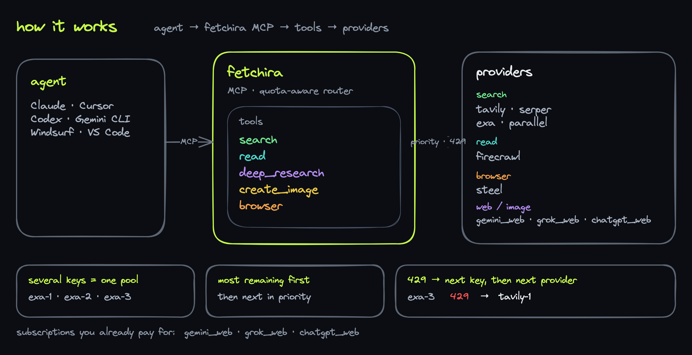
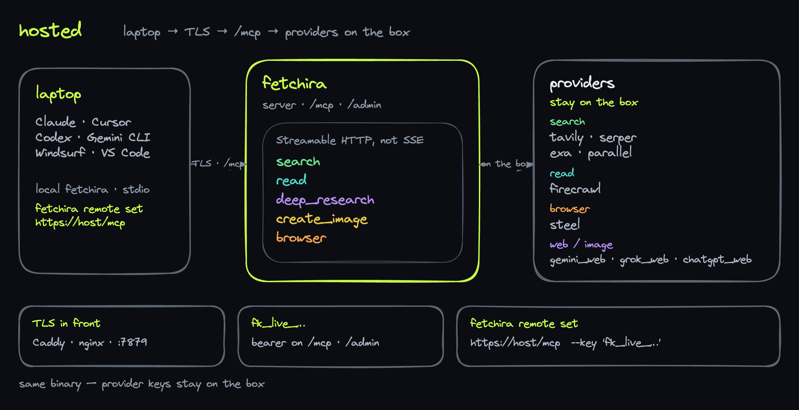
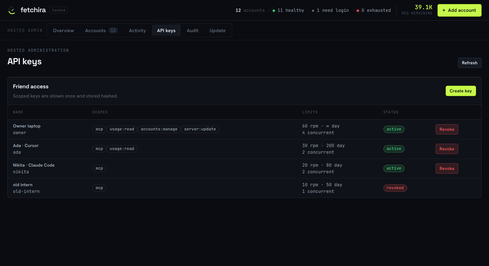

# fetchira

Give your agent search, read, deep research, image gen, and a browser - from free-tier providers and from subscriptions you already pay for. Gemini and Grok web sessions, plus ChatGPT through Chrome/Chromium, can also answer questions about an attached file.

Providers come with some free quota, so you can start fetchira with no paid subscriptions: free-tier search keys (several Exa accounts = more quota), and ChatGPT or Gemini sessions if you already pay for those. A router picks the least-exhausted account and fails over on 429. Replies stay compact so the MCP does not eat the model's context.

Hosted: same binary on a server. Agents connect with a key.




## Quick start

**Mac**

```sh
brew install ImmuneFOMO/tap/fetchira
```

**Linux x86_64**

```sh
curl -fsSL https://raw.githubusercontent.com/ImmuneFOMO/fetchira/main/install.sh | sh
```

**Linux arm64** (build from source for the current release)

```sh
cargo install --locked --git https://github.com/ImmuneFOMO/fetchira
```

`curl | sh` puts a prebuilt in `~/.local/bin` on macOS (arm64/x86_64) and Linux x86_64 (glibc >= 2.34) — run `export PATH="$HOME/.local/bin:$PATH"` if `fetchira` is missing. The current v0.1.13 release has no Linux arm64 archive, so build that platform with `cargo install --locked --git https://github.com/ImmuneFOMO/fetchira` (needs Rust, cmake, Perl, pkg-config, and a C/C++ toolchain; binary lands in `~/.cargo/bin`).

`fetchira ui` opens the local dashboard and keeps running; use another terminal for CLI setup:

```sh
fetchira providers                # see every provider and its capability
fetchira add serper --key KEY     # API-key provider; never omit --key
fetchira add gemini_web            # web-session provider; a browser opens for login
fetchira list                     # expect key or session, not NO KEY / NEEDS LOGIN
```

Config lives in `$FETCHIRA_HOME`, otherwise `$XDG_CONFIG_HOME/fetchira` (default `~/.config/fetchira`).

Bare `fetchira` in a TTY opens the dashboard. A coding tool starts bare `fetchira` with piped stdio, where it waits for MCP messages; use `fetchira ui` when you want the dashboard.

### Choose providers

Every provider is optional. Start with one or two that match the job, then add more as needed. API-key providers use the signup link below; web providers use a browser login and do not need an API key.

| Provider | Auth | Useful for | Start here |
|---|---|---|---|
| `serper` | API key | Google search and page reads | [serper.dev](https://serper.dev) |
| `tavily` | API key | Search, answers and page reads | [app.tavily.com](https://app.tavily.com) |
| `exa` | API key | Semantic search and research | [exa.ai](https://exa.ai/?ref=immunefomo) |
| `firecrawl` | API key | Search, scrape and crawl pages | [firecrawl.link](https://firecrawl.link/immunefomo) |
| `parallel` | API key | Search and deep research | [parallel.ai](https://parallel.ai) |
| `steel` | API key | Browser and JavaScript page reads | [steel.dev](https://steel.dev) |
| `gemini_web` | Browser login | Search, research, images and file Q&A | Google account |
| `grok_web` | Browser login | Search, research, images and file Q&A | X/Grok account |
| `chatgpt_web` | Browser login + Chrome/Chromium | Search, research, images and file Q&A | OpenAI account |

The provider's own plan and quota are authoritative; free tiers and prices change. `fetchira providers` prints the same catalog from the installed binary.

**Copy for your agent**

```
Set up fetchira locally on this machine. Use the real CLI only; do not invent flags.

Install:
- macOS: `brew install ImmuneFOMO/tap/fetchira`
- macOS without Homebrew or Linux x86_64: `curl -fsSL https://raw.githubusercontent.com/ImmuneFOMO/fetchira/main/install.sh | sh`, then `export PATH="$HOME/.local/bin:$PATH"` if needed
- Linux arm64: `cargo install --locked --git https://github.com/ImmuneFOMO/fetchira` (needs Rust, cmake, Perl, pkg-config and a C/C++ toolchain)

Do not run bare `fetchira`, `fetchira install`, or `fetchira setup`: the first opens a dashboard or waits for MCP, and the latter two are interactive. Run `fetchira providers`, recommend one or two providers, and ask me which ones to use.

For an API-key provider, show its signup link from the README, wait for me to paste the key, then run `fetchira add PROVIDER --key 'KEY'`. Never omit `--key`, never print the key, and never run the command before I provide it.
For `gemini_web`, `grok_web`, or `chatgpt_web`, run `fetchira add PROVIDER`, tell me that a browser window opens, and wait for me to finish login (up to 5 minutes).

Run `fetchira list`; every selected account must show `key` or `session`, not `NO KEY` or `NEEDS LOGIN`. Register fetchira with the coding tool we are using: for Claude Code run `claude mcp add fetchira -s user -- "$(command -v fetchira)"`; for another tool use the exact config snippet and path from the README. Do not use a raw hosted URL for local setup.

Restart the coding tool or reload its MCP servers. Verify by asking it to search for a current topic and report whether the Fetchira tool answered.
```

## Use it

The binary speaks MCP over stdio. For a human in a terminal, the interactive installer can register it with detected coding tools:

```sh
fetchira install
```

The picker writes the selected clients' configs and is not suitable for an agent. Restart the selected tool after registration.

You can also paste the snippet for your client. Use the absolute path from `command -v fetchira` (Homebrew: `/opt/homebrew/bin/fetchira` or `/usr/local/bin/fetchira`; `curl | sh`: `$HOME/.local/bin/fetchira`; `cargo install`: `$HOME/.cargo/bin/fetchira`).

**Claude Code**

```sh
claude mcp add fetchira -s user -- "$(command -v fetchira)"
```

Skill (when to call the tools): copy `skills/fetchira/SKILL.md` to `~/.claude/skills/fetchira/SKILL.md`.

**Cursor** — `~/.cursor/mcp.json`

**Windsurf** — `~/.codeium/windsurf/mcp_config.json`

**Gemini CLI** — `~/.gemini/settings.json`

**Claude Desktop** (macOS) — `~/Library/Application Support/Claude/claude_desktop_config.json`

```json
{ "mcpServers": { "fetchira": { "command": "/absolute/path/to/fetchira" } } }
```

**Codex CLI** — `~/.codex/config.toml`

```toml
[mcp_servers.fetchira]
command = "/absolute/path/to/fetchira"
args = []
```

**OpenCode** — `~/.config/opencode/opencode.json`

```json
{
  "mcp": {
    "fetchira": { "type": "local", "command": ["/absolute/path/to/fetchira"], "enabled": true }
  }
}
```

Paths under `~/.config` use `$XDG_CONFIG_HOME` when set to an absolute path.

**VS Code** — macOS `~/Library/Application Support/Code/User/mcp.json` (`fetchira install` writes this); Linux `~/.config/Code/User/mcp.json`

```json
{ "servers": { "fetchira": { "type": "stdio", "command": "/absolute/path/to/fetchira" } } }
```

## Hosted

Same binary, same router. MCP is Streamable HTTP at `/mcp`, not SSE. `fetchira server` (alias `serve-http`) binds `127.0.0.1:7879` by default. A persistent master key is required; losing it makes encrypted provider credentials unrecoverable.





### Fast deploy

Install fetchira on the server (same as Quick start, or copy the binary). Run `server` and `key create` as the same user with the same `$FETCHIRA_HOME`:

```sh
export FETCHIRA_HOME="${FETCHIRA_HOME:-$HOME/.config/fetchira}"
mkdir -p "$FETCHIRA_HOME"
chmod 700 "$FETCHIRA_HOME"
master_key_file="$FETCHIRA_HOME/master-key"
if [ ! -e "$master_key_file" ]; then
  (umask 077; set -C; openssl rand -base64 32 > "$master_key_file") 2>/dev/null || [ -s "$master_key_file" ]
fi
chmod 600 "$master_key_file"
export FETCHIRA_MASTER_KEY_FILE="$master_key_file"
FETCHIRA_BIND=127.0.0.1:7879 fetchira server             # leave this process running
```

The `if` block creates the key once and preserves it on later starts. Repeat the `FETCHIRA_HOME` and `FETCHIRA_MASTER_KEY_FILE` exports in any other terminal that runs `fetchira server key create`.

Keep the server on loopback while setting it up. From your laptop, open a tunnel with `ssh -N -L 7879:127.0.0.1:7879 USER@HOST`, then open `http://127.0.0.1:7879/admin` and set a password of at least 12 characters. Add API-key and web-session providers from the hosted admin UI; the CLI fallback is `fetchira add PROVIDER --key 'KEY'` for API keys before starting the server (restart after adding one).

Do not put the admin password itself in `FETCHIRA_ADMIN_PASSWORD`: that variable accepts an Argon2id hash from `printf '%s\n' '…' | fetchira server password hash` (a TTY is refused). Leave it unset for first-visit setup.

Complete first-visit setup before exposing the server through TLS. After the password is set, configure the reverse proxy below and only then publish the hostname.

Mint a key in another terminal (same user and repeated exports). The default scopes are `mcp` + `usage:read`; add `--accounts-manage` only to a trusted key that must upload web sessions or manage accounts. That scope also permits deleting accounts and changing their credentials and proxies. The plaintext prints once:

```sh
fetchira server key create laptop "Laptop"
# Only when this key must run `fetchira remote login`:
# fetchira server key create owner "Owner laptop" --accounts-manage
```

If an older installed binary rejects `--accounts-manage`, create the key in the admin UI and select that scope; the flag is available in the current checkout and the next release.

Leave fetchira on loopback and put TLS in front — `remote set` requires HTTPS (loopback HTTP is fine for a local smoke test). API-key providers and uploaded Gemini/Grok web sessions work without a browser on a bare-metal server. ChatGPT requests and live limits always need Chrome/Chromium on the machine running the hosted process; the Compose image includes Chrome.

```caddyfile
fetchira.example.com {
    reverse_proxy 127.0.0.1:7879 {
        flush_interval -1
    }
}
```

Docker Compose is the other happy path (Chrome in the image, optional bundled Caddy). Clone the repo on the server and follow [docs/hosted.md](docs/hosted.md). After `up`:

```sh
docker compose --env-file .env.hosted -f docker-compose.hosted.yml exec fetchira \
  fetchira server key create laptop "Laptop"
```

### On your laptop

Coding tools still launch local `fetchira` over stdio. Point that process at hosted `/mcp`:

```sh
fetchira remote set https://fetchira.example.com/mcp --key 'fk_live_...'
fetchira remote check
```

Do not paste the hosted URL into the tool as a raw MCP endpoint unless it speaks Streamable HTTP and bearer auth.

Add API-key providers in `/admin` or, as a CLI fallback, on the server with `fetchira add PROVIDER --key 'KEY'` while it is stopped; restart the hosted process after changing its config. For web providers, add them in `/admin`, then on a machine with a browser (after `remote set`) run the displayed `fetchira remote login CHALLENGE`. Optional: `--browser chrome|firefox` or `--file session.json`.

The hosted bridge does not upload laptop file paths: file attachments and file Q&A require local mode. Hosted image outputs are returned to the local bridge and saved on your laptop.

systemd, nginx, backups: [docs/hosted.md](docs/hosted.md).

**Copy for your agent**

```
Deploy hosted fetchira on this server, then point my local fetchira at it.
Real CLI only — do not invent flags. `fetchira add PROVIDER --key 'KEY'`: never omit `--key`.
Do not run bare `fetchira`, `fetchira ui`, `fetchira install`, or `fetchira setup`.

Install on the server (same as Quick start). Same user for `server` and `key create`.
If `fetchira` is not found: export PATH="$HOME/.local/bin:$HOME/.cargo/bin:$PATH"

Server:
  export FETCHIRA_HOME="${FETCHIRA_HOME:-$HOME/.config/fetchira}"
  mkdir -p "$FETCHIRA_HOME"; chmod 700 "$FETCHIRA_HOME"
  master_key_file="$FETCHIRA_HOME/master-key"
  if [ ! -e "$master_key_file" ]; then (umask 077; set -C; openssl rand -base64 32 > "$master_key_file") 2>/dev/null || [ -s "$master_key_file" ]; fi
  chmod 600 "$master_key_file"
  export FETCHIRA_MASTER_KEY_FILE="$master_key_file"
  # Ask me for API keys; for each selected API provider run `fetchira add PROVIDER --key 'KEY'` before starting the server.
  FETCHIRA_BIND=127.0.0.1:7879 fetchira server &     # alias serve-http; Streamable HTTP at /mcp, not SSE
  # Before TLS/public exposure, tunnel from my laptop and set the first admin password:
  # ssh -N -L 7879:127.0.0.1:7879 USER@HOST
  # open http://127.0.0.1:7879/admin; password must be at least 12 characters
  # In another server shell, repeat FETCHIRA_HOME and FETCHIRA_MASTER_KEY_FILE, then:
  fetchira server key create laptop "Laptop"       # prints fk_live_... once; defaults mcp+usage:read
  # Add --accounts-manage only for remote login/session upload or account management.

Laptop, keep stdio:
  fetchira remote set https://HOST/mcp --key 'fk_live_...'  # never omit --key
  fetchira remote check
  # web providers: fetchira remote login CHALLENGE   (from /admin; needs remote set first)
  # register local stdio with Claude Code: claude mcp add fetchira -s user -- "$(command -v fetchira)"
  # for another client, use the README config snippet with the local absolute binary path
  # restart the coding tool and ask it to search for a current topic

TLS in front (`remote set` requires HTTPS; loopback HTTP is fine for a smoke test).
Compose/Caddy: docs/hosted.md. Do not paste /mcp as a raw MCP URL.
```
