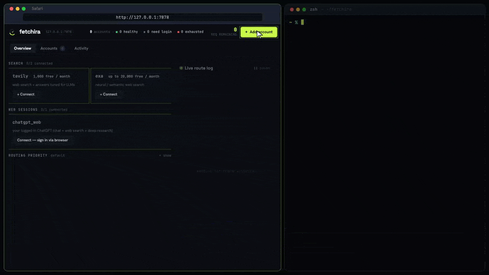

# Fetchira

Web search, page reading, deep research and image generation through one router. Use the
local CLI or connect your agent through MCP. Bring an API key or a supported web session;
Fetchira routes requests across your configured accounts and providers.

## Start locally

Install on macOS with Homebrew:

```sh
brew install ImmuneFOMO/tap/fetchira
```

On Linux or macOS without Homebrew:

```sh
curl -fsSL https://raw.githubusercontent.com/ImmuneFOMO/fetchira/main/install.sh | sh
```

See [installation](docs/setup.md#install) for Linux arm64, building from source and PATH setup.

Add a provider and make a request:

```sh
fetchira add serper --key 'YOUR_SERPER_KEY'
fetchira search "latest Rust release"
fetchira read "https://example.com"
```

Get a Serper key at [serper.dev](https://serper.dev), or run `fetchira providers` to choose
another provider. Each provider has its own plan and quota; paid features can consume a
paid balance. For browser login instead of an API key, run `fetchira add gemini_web`.

MCP is optional. For an agent, run `fetchira install` to choose MCP clients and a skill
(MCP first with CLI fallback, MCP only, or CLI only), then restart the agent.
`fetchira ui` opens the local dashboard.


## Choose a guide

| I want to… | Guide |
|---|---|
| Install, connect an agent, or choose a skill | [Setup](docs/setup.md) |
| Search, research, generate images, or continue a session from a shell | [CLI](docs/cli.md) |
| Manage accounts, quotas, proxies, or troubleshoot a failure | [Configuration](docs/configuration.md) |
| Share one private server through authenticated MCP | [Hosted deployment](docs/hosted.md) |
| Build, test, contribute, or release | [Contributing](CONTRIBUTING.md) · [Releasing](docs/releasing.md) |

## Hosted

Run Fetchira on your server with Docker Compose or systemd. One administrator owns the
provider accounts and issues scoped keys to trusted users. Agents connect through the local
stdio bridge to the server's authenticated Streamable HTTP endpoint:

```sh
fetchira remote set https://fetchira.example.com/mcp --key 'fk_live_...'
fetchira remote check
```

[Deploy the server first](docs/hosted.md). Hosted mode requires a persistent encryption key
and HTTPS outside loopback. Local file attachments and one-shot CLI commands require local
mode; generated hosted images are saved on the laptop by the MCP bridge.

[Apache-2.0 license](LICENSE) · [Report a security issue](SECURITY.md)
